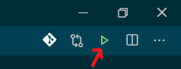
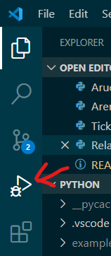
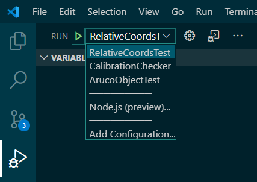
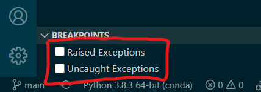
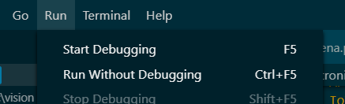

## Run configurations

This button always runs whatever file is currently being edited:

The problem with that is it sets the Python search path to whatever folder that file is in, so it can't find any code outside of that folder. The better way to run stuff is using the run tab:

In this tab is a little run button next to a dropdown menu, containing _run configurations_:

Run configurations are specified in [`launch.json`](.vscode/launch.json) (open it using the settings icon next to the dropdown). These allow the Python search path to be specified relative to the _workspace_ (the folder this README is in) rather than the file being run.

At the bottom are two checkboxes, which are the equivalent of MATLAB's _stop on error_ option.

Finally, you can run whatever was run last using the **Run -> Start Debugging** or by pressing F5:

**Run Without Debugging** (Ctrl+F5) is the same, but ignoring any breakpoints.